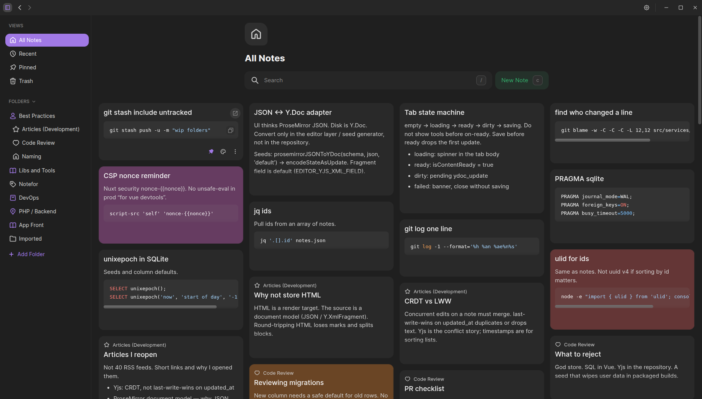
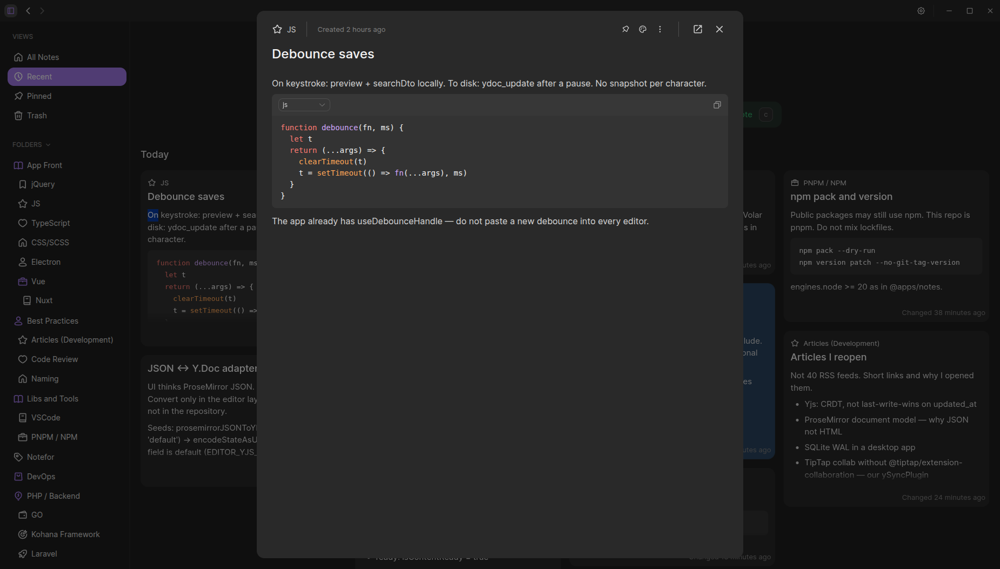
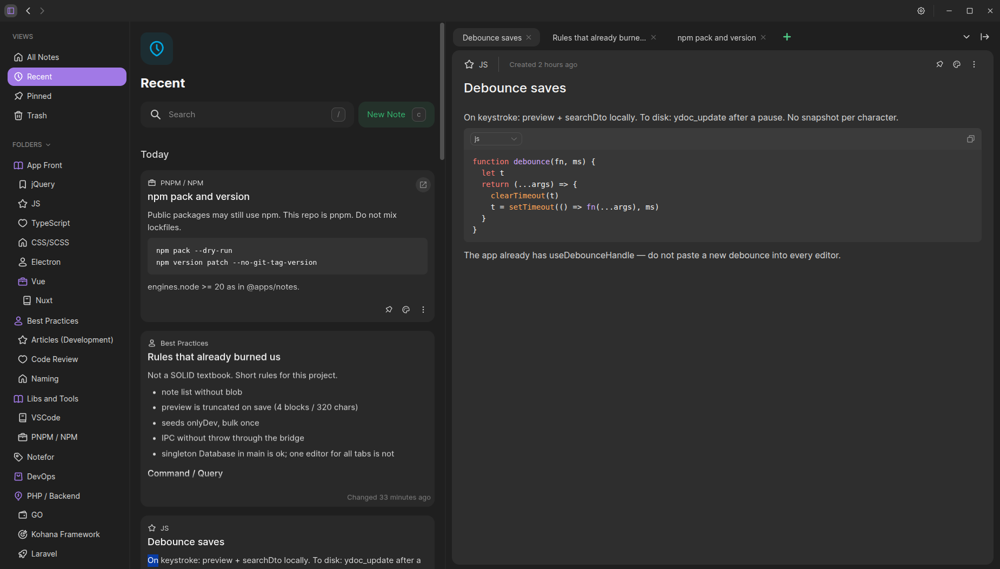
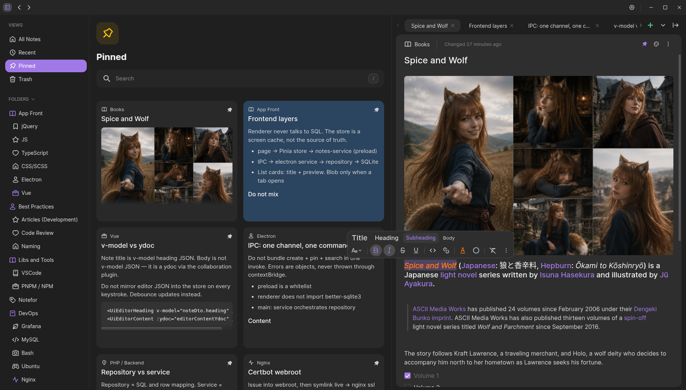

# EnoteSpace

- [Latest release](https://github.com/senobraz/enotespace/releases/latest)
- [Installation](install.md)
- [Stack](stack.md)

I've been using Google Keep for a very long time. I like its simplicity.

But over time, I realized that I was missing some features. I wanted a more powerful editor, better ways to organize
notes, and the ability to keep my data stored locally instead of relying on a cloud service.

So I decided to build my own note-taking app, keeping the simplicity of Google Keep while adding the features I felt
were missing.

## Features

### Local Storage & Privacy

All data is stored locally on your device. The application's database is fully encrypted, so your notes are never stored
in plain text.

The app does not impose any limit on the number of notes you can create.

### Note Cards

Notes are displayed as cards that automatically adapt to the available screen width. Even with a large number of notes,
the interface remains smooth and responsive.

### Note Organization

The app includes built-in **Recent** and **Pinned** folders, as well as custom folders with support for deeply nested
hierarchies.

### Note Views

A note can be opened in a dialog when you just need to quickly view or edit something.

For more extensive work, you can use the tabbed interface, which makes it convenient to work with multiple notes at the
same time and switch between them quickly.

### Rich Text Editor

The rich text editor lets you create and format your notes with ease.

It supports:

- checklists;
- images;
- code highlighting;
- text formatting;
- pasting Markdown from the clipboard and automatically converting it into formatted content.

## Other Features

- 🔍 Note search
- 📌 Pinning notes
- 🎨 Colored note cards
- 🌐 Multiple interface languages
- 🌙 Dark theme
- 🎨 Customizable accent color
